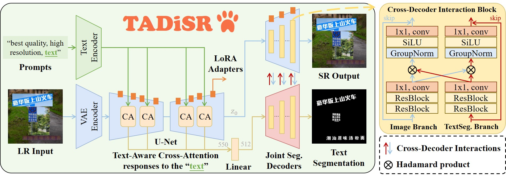
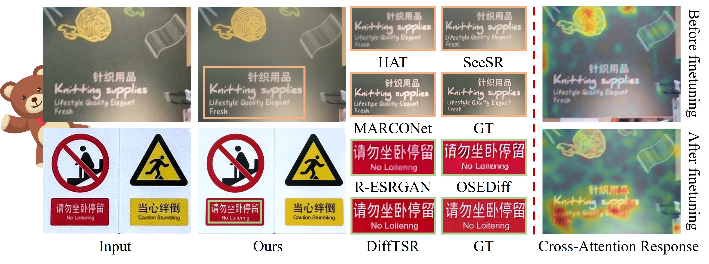

# TADiSR: Text-Aware Real-World Image Super-Resolution

<p align="center">
  <a href="https://arxiv.org/abs/2506.04641">Paper</a> |
  <a href="https://github.com/mingcv/TADiSR">Code</a> |
  <a href="https://huggingface.co/huqiming513/TADiSR-Models">Models</a>
</p>

<p align="center">
  Qiming Hu, Linlong Fan, Yiyan Luo, Yuhang Yu, Xiaojie Guo, Qingnan Fan
  <br>
  Tianjin University and vivo Mobile Communication Co. Ltd
</p>

<p align="center">
  
  <br>
  <sub>Architecture of text-aware cross-attention and joint segmentation decoders.</sub>
</p>

TADiSR is a diffusion-based framework for 4x real-world image super-resolution
that explicitly protects scene text. It fine-tunes the diffusion transformer's
cross-attention with LoRA and jointly decodes the super-resolved image and a
full-image text mask. This avoids OCR-box cropping and fusion, so the model
handles long, vertical, bilingual, and irregular text in one pass.

The release includes the paper's Kolors model and a CogView4-6B variant. The
CogView4 model is the recommended public checkpoint for Chinese text because
its base model has stronger Chinese text generation ability.

## Method Overview

TADiSR has three coupled components:

- **Text-aware cross-attention.** LoRA updates the diffusion transformer's
  attention layers so their spatial response is more sensitive to text regions.
- **Joint segmentation decoders.** A dual-stream decoder consumes denoised VAE
  features and produces the SR image and a text-mask logit map. Cross-stream
  interaction shares text structure with image reconstruction at every scale.
- **FTSR synthesis.** Fine-grained bilingual text masks and restored text crops
  are composited on high-quality backgrounds; training then mixes this 50k
  synthetic set with filtered, paired Real-CE samples.

The paper trains a 4x model with a fixed diffusion timestep of 200 and combines
pixel, LPIPS, OCR-region edge, segmentation, Dice, focal, and mask-guided
reconstruction losses. Please see the paper for the exact protocol and scores.

<p align="center">
  
  <br>
  <sub>Qualitative comparison and cross-attention response before and after fine-tuning.</sub>
</p>

## Model Zoo

| Model | Base model | Training data | Checkpoint | SHA256 | Notes |
| --- | --- | --- | --- | --- | --- |
| TADiSR-Kolors | [Kwai-Kolors/Kolors](https://huggingface.co/Kwai-Kolors/Kolors) | FTSR | [download](https://huggingface.co/huqiming513/TADiSR-Models) | `4baef8b1...13251e7f7` | Paper model, 187 MB adapter checkpoint |
| TADiSR-CogView4-RealCE | [zai-org/CogView4-6B](https://huggingface.co/zai-org/CogView4-6B) | FTSR + Real-CE | [download](https://huggingface.co/huqiming513/TADiSR-Models) | `7cec8d09...e0baf5e0` | Recommended Chinese-text model, 749 MB adapter checkpoint |

The complete file names, byte sizes, and full checksums are in
[`checkpoints/manifest.json`](checkpoints/manifest.json). Adapter checkpoints
are deliberately stored outside Git; base-model licenses continue to apply.

## Installation

```bash
conda create -n tadisr python=3.10 -y
conda activate tadisr

# Select the PyTorch command matching your CUDA runtime at pytorch.org first.
pip install torch torchvision --index-url https://download.pytorch.org/whl/cu121
pip install -r requirements.txt
```

The CogView4 inference implementation requires a recent Diffusers build with
`CogView4Transformer2DModel`. We tested the code contract against Diffusers
`>=0.32.0`; install the current stable release if an older environment lacks
that class.

## Download Models

The base model and TADiSR adapter are separate downloads.

```bash
# CogView4 base model: approximately 31 GB.
python scripts/download_base_model.py --model cogview4 --output-dir weights/CogView4

# Download tadisr_cogview4_realce_17500.pkl from huqiming513/TADiSR-Models on Hugging Face.
# Then verify it before GPU construction.
python scripts/validate_checkpoint.py \
  --checkpoint checkpoints/tadisr_cogview4_realce_17500.pkl \
  --variant cogview4

python scripts/verify_checksums.py \
  --checkpoint checkpoints/tadisr_cogview4_realce_17500.pkl \
  --model tadisr-cogview4-realce

# Create the deterministic quality-prompt embedding required by the released model.
python prepare_prompt_embeddings.py \
  --base-model weights/CogView4 \
  --output weights/CogView4/saved_prompt_tokens_nocfg.pt
```

The original Kolors base model is approximately 29 GB. Its adapter is included
in the model release for archival and compatibility; the maintained public
inference command in this repository targets the CogView4 release.

## Inference

Run one image. Input is bicubic-upsampled by 4x, then processed with weighted,
overlapping tiles to avoid seams. The command writes `sr.png` and
`text_mask.png`.

```bash
python scripts/infer.py \
  --input /path/to/your_lr_image.png \
  --output-dir results/example \
  --checkpoint checkpoints/tadisr_cogview4_realce_17500.pkl \
  --base-model weights/CogView4 \
  --prompt-embeddings weights/CogView4/saved_prompt_tokens_nocfg.pt \
  --scale 4 --tile 768 --overlap 256
```

Use a CUDA GPU. CogView4-6B needs substantially more memory than the 8 GB
consumer-GPU class for this unoffloaded implementation; use a 24 GB or larger
GPU for practical 768px tiles, or lower `--tile` while testing. The output mask
contains sigmoid probabilities in grayscale, where brighter values indicate
text regions.

## Training

The original training scripts are retained for experiment reproduction:

```bash
accelerate launch train_cogview4.py \
  --train_folders /path/to/FTSR \
  --pretrained_model_name_or_path weights/CogView4 \
  --prompt_embeddings weights/CogView4/saved_prompt_tokens_nocfg.pt \
  --output_dir output/TADiSR/TADiSR_CogView4

accelerate launch train_cogview4_realce.py \
  --train_folders /path/to/FTSR \
  --test_folder /path/to/RealCE \
  --realce_train_list data/RealCE/aligned_list_train.txt \
  --realce_eval_list data/RealCE/aligned_list_eval.txt \
  --pretrained_model_name_or_path weights/CogView4 \
  --prompt_embeddings weights/CogView4/saved_prompt_tokens_nocfg.pt \
  --output_dir output/TADiSR/TADiSR_CogView4_RealCE
```

We do not distribute FTSR, Real-CE image files, PP-OCR weights, or either base
model in this repository.

## Repository Map

| Path | Purpose |
| --- | --- |
| `tadisr/checkpoint.py` | CPU-safe checkpoint inspection and compatibility contract |
| `tadisr/tiling.py` | Overlap-aware, weighted tiled inference |
| `tadisr/inference.py` | Public CogView4 model-loading and image I/O API |
| `tadisr_pipelines.py` | Diffusion/VAE and joint segmentation implementation |
| `scripts/infer.py` | Single-image CLI inference |
| `scripts/validate_checkpoint.py` | State-dict structure validation |
| `scripts/verify_checksums.py` | SHA256 and byte-size verification against the release manifest |
| `checkpoints/manifest.json` | Release filenames, sizes, and SHA256 checksums |

## License and Acknowledgements

The code in this repository is released under the [MIT License](LICENSE).
Released adapters are for research use and remain subject to the licenses of
their base models. In particular, consult the Kolors license for commercial-use
terms. This implementation builds on [Diffusers](https://github.com/huggingface/diffusers),
[PEFT](https://github.com/huggingface/peft), CogView4, Kolors, and PP-OCR.
The figures in `assets/` are reproduced from the accompanying paper.

## Citation

```bibtex
@article{hu2025tadisr,
  title={Text-Aware Real-World Image Super-Resolution via Diffusion Model with Joint Segmentation Decoders},
  author={Hu, Qiming and Fan, Linlong and Luo, Yiyan and Yu, Yuhang and Guo, Xiaojie and Fan, Qingnan},
  journal={arXiv preprint arXiv:2506.04641},
  year={2025}
}
```
